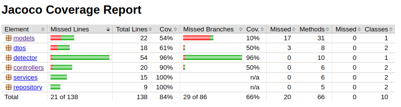

<p align="center"> 
  
</p>

# Examen Mercadolibre: Mutantes 

## Introducción
La problemática planteada es poder detectar mediante una API REST, si un ADN corresponde a un mutante o no. Luego poder obtener estadísticas de los resultados. Para el enunciado completo, [clickear aquí](mutants/doc/Examen%20Mercadolibre%202017%20.pdf).

## Aplicación
La aplicación consta de dos servicios

- Verificación de un ADN particular:

Ejecutar un ```POST``` al siguiente endpoint:
http://ec2-18-219-215-16.us-east-2.compute.amazonaws.com:9000/mutant
con el siguiente body:
```
{
  "dna":["ATGCAA", "CGGATA", "TAATGT", "AAGGGG", "CCCTTA", "TTACTT"]
}
```
Esto puede devolver los siguientes status:

```200 OK``` Para un ADN mutante.

```403 FORBIDDEN``` Para un ADN humano.

- Estadísticas:

Ejecutar un ```GET``` al siguiente endpoint:
http://ec2-18-219-215-16.us-east-2.compute.amazonaws.com:9000/stats

Esto devolverá el siguiente status:
```200 OK```
Con el siguiente body response (de ejemplo):
```
{
  "ratio":0.5,"count_mutant_dna":2,"count_human_dna":4
}
```

## Implementación y desarrollo
La aplicación fue desarrollada en Java 1.8, aprovechando las mejoras a la API de concurrencia que provee esta versión.
El framework web utilizado fue Play en su versión 2.6.11. Se utilizó sbt para el manejo de librerías, las cuales fueron:
- Connector de MySQL.
- Base de datos en memoria H2. Para agilizar la ejecución de tests.
- JaCoCo para el coverage de los test.
- Ebean, el ORM utilizado.

El framework utiliza internamente Gradle para el manejo de su versión, la versión de Java y la de Scala.

La base de datos elegida fue MySQL versión 5.7.21.

Para los test se utilizó jUnit y para el manejo de logs, slf4j.

## Entorno local
Si se quiere ejecutar la aplicación en un entorno local, se debe configurar en mutants/conf/application.conf las credenciales de acceso a MySQL y el nombre de la base de datos local. Luego ir al directorio mutants/ y ejecutar en consola ```sbt run```
Esto levanta la aplicación en el puerto 9000 por defecto. Las URLs antes mencionadas ahora serían:
```http://localhost:9000/mutant``` y ```http://localhost:9000/stats```

## Test
Para los test se utilizó jUnit. Se testeó exhaustivamente el algoritmo de detección, considerando los casos borde, y se hicieron test de API para ambos servicios.
Para estos últimos se utilizó H2, una base de datos en memoria, para no depender de una instancia local de MySQL y poder correr los test rápidamente. Se asegura la integridad entre la ejecución de cada test unitario, ya que la base de datos se destruye en cada ejecución.

## Coverage
Para el coverage de los test, se utilizó la herramienta JaCoCo. Se puede observar un coverage del 84%.




